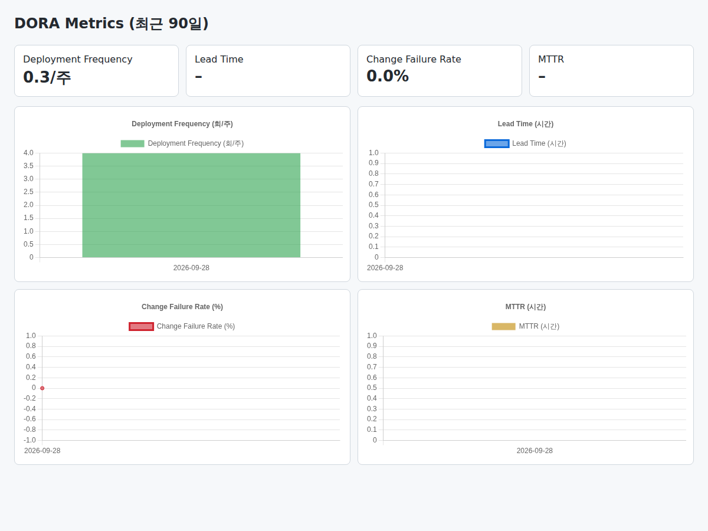

# Week 02 - DORA 지표 자동 수집

## 과제 요구사항
GitHub Actions 워크플로우를 작성해 DORA 4대 지표(Lead Time, Deployment Frequency, MTTR, Change Failure Rate)를 자동 수집한다. 대시보드 시안 또는 구현 결과를 함께 제시한다.

## 구현 결과

## 증거 링크
- 워크플로우 파일: [dora.yml](../.github/workflows/dora.yml)
- Actions 실행 내역: https://github.com/pckdou/oss/actions/workflows/dora.yml
- 수집 스크립트: [dora.mjs](../scripts/dora.mjs)
- 대시보드 코드: [index.html](../docs/index.html)